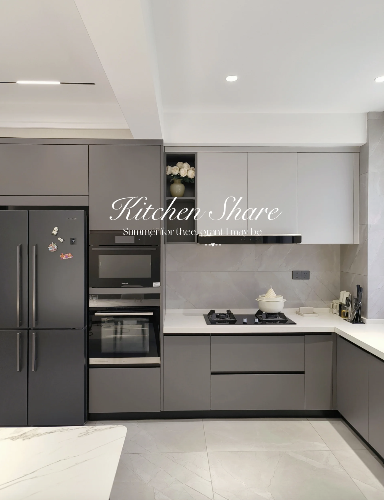

- [插座孔](./port.html)
- [家具尺寸](./size.html)
- [投影機尺寸](./tv.html)

#### 風格
   * [參考](https://www.xiaohongshu.com/explore/654b0621000000001e00d1fc?app_platform=android&app_version=8.11.0&author_share=2&ignoreEngage=true&share_from_user_hidden=true&type=normal&xhsshare=CopyLink&appuid=5fca4c68000000000101fd47&apptime=1699926539)
   * [參考](https://www.xiaohongshu.com/explore/6548b12c000000001e030e2b?app_platform=android&app_version=8.11.0&author_share=2&ignoreEngage=true&share_from_user_hidden=true&type=video&xhsshare=CopyLink&appuid=5fca4c68000000000101fd47&apptime=1699926467)
    
   
   

#### 基礎佈局
    
   * [抽拉中島](https://www.xiaohongshu.com/explore/6363298c0000000009011e6e?app_platform=android&app_version=8.11.5&author_share=2&ignoreEngage=true&share_from_user_hidden=true&type=normal&xhsshare=CopyLink&appuid=5fca4c68000000000101fd47&apptime=1702574874)
   * [沙發旁收納bar](./bar_size.html)

#### 玄關櫃體
   *  進門左側半開放牆面,小中島
    

#### 玄關櫃體2
    

### 燈飾
   
   *玄關電視櫃貨房間走道
   
#### 廚房
    
   

#### 主臥
  * [風格](https://www.xiaohongshu.com/explore/6468a152000000000800cce1?app_platform=android&app_version=8.11.0&author_share=2&ignoreEngage=true&share_from_user_hidden=true&type=video&xhsshare=CopyLink&appuid=5fca4c68000000000101fd47&apptime=1699926435)
  * [風格]( https://www.bilibili.com/video/BV1m24y12734/?vd_source=7c6d0cc8944e63ca7600b0d0aa49ee1d
) 
#### 次臥
   * [沙發床](https://m.tb.cn/h.5nKMKcY?tk=aO9UWg364hn) 

### 特殊家具
#### 單槓
    
   
#### 旋轉桌
   * https://www.facebook.com/watch/?v=3096929037187028&ref=sharing
   * https://www.facebook.com/watch/?v=368636154783706
   * https://world.taobao.com/item/662852751641.htm