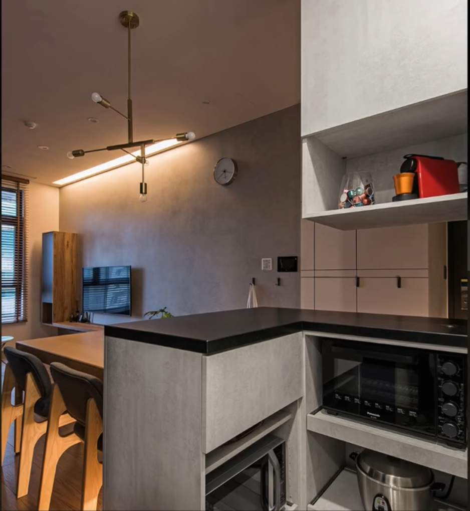

- [風格](#風格)
- [玄關](#玄關)
- [旋轉桌系統櫃](#旋轉桌)
- [廚房](#廚房)
- [插座孔](./port.html)
- [家具尺寸](./size.html)

#### 風格
    

#### 玄關
   *  進門左側半開放牆面,小中島
   * style1
    
    
   * 做成小bar台
    
     
   
   * style2
   
   * 玻璃櫥櫃
   
   

#### 廚房
    
   

#### 旋轉桌
   * https://www.facebook.com/watch/?v=3096929037187028&ref=sharing
   * https://www.facebook.com/watch/?v=368636154783706
   * https://world.taobao.com/item/662852751641.htm